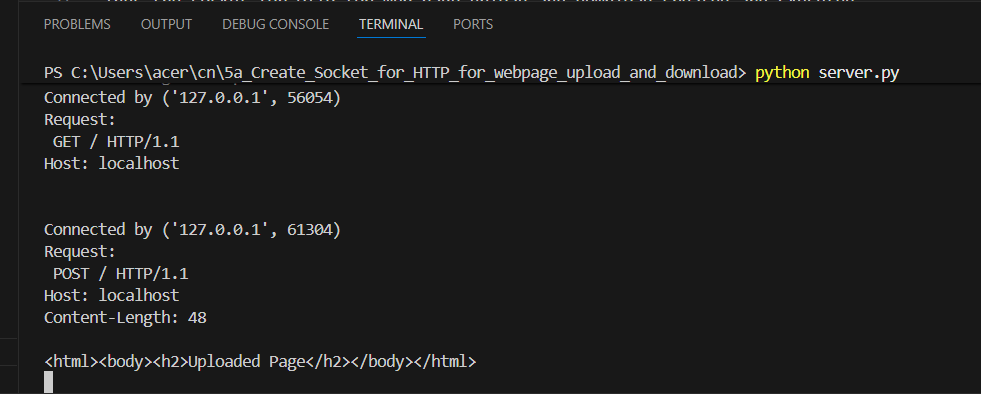
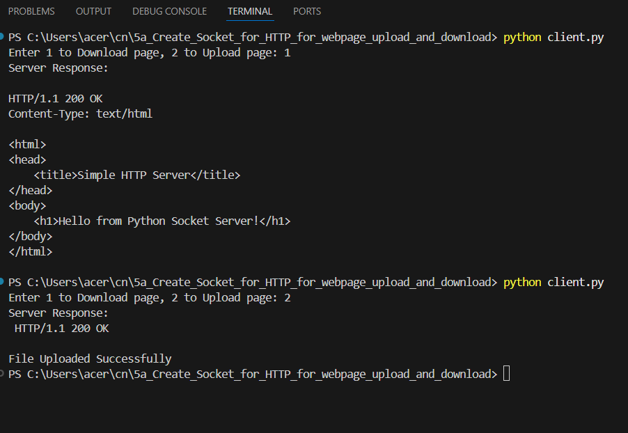

# 5a_Create_Socket_for_HTTP_for_webpage_upload_and_download
## AIM :
To write a PYTHON program for socket for HTTP for web page upload and download
## Algorithm

1.Start the program.
 
2.Get the frame size from the user
 
3.To create the frame based on the user request.
 
4.To send frames to server from the client side.
 
5.If your frames reach the server it will send ACK signal to client otherwise it will send NACK signal to client.
 
6.Stop the program
 

## Program 
## server.py:
import socket
HOST = '127.0.0.1'  
PORT = 8080    
server_socket = socket.socket(socket.AF_INET, socket.SOCK_STREAM)
server_socket.bind((HOST, PORT))
server_socket.listen(5)
print("Server running on http://127.0.0.1:8080")
while True:
    client_socket, addr = server_socket.accept()
    print("Connected by", addr)
    request = client_socket.recv(1024).decode()
    print("Request:\n", request)
    if "GET" in request:
        with open("index.html", "r") as file:
            content = file.read()
        response = "HTTP/1.1 200 OK\n"
        response += "Content-Type: text/html\n\n"
        response += content
        client_socket.send(response.encode())
    elif "POST" in request:
        data = request.split("\r\n\r\n")[1]
        with open("uploaded.html", "w") as file:
            file.write(data)
        response = "HTTP/1.1 200 OK\n\nFile Uploaded Successfully"
        client_socket.send(response.encode())
    client_socket.close()
## client.py:
import socket
HOST = '127.0.0.1'
PORT = 8080
client_socket = socket.socket(socket.AF_INET, socket.SOCK_STREAM)
client_socket.connect((HOST, PORT))
choice = input("Enter 1 to Download page, 2 to Upload page: ")
if choice == "1":
    request = "GET / HTTP/1.1\r\nHost: localhost\r\n\r\n"
    client_socket.send(request.encode())
    response = client_socket.recv(4096).decode()
    print("Server Response:\n")
    print(response)
elif choice == "2":
    data = "<html><body><h2>Uploaded Page</h2></body></html>"
    request = "POST / HTTP/1.1\r\n"
    request += "Host: localhost\r\n"
    request += "Content-Length: " + str(len(data)) + "\r\n\r\n"
    request += data
    client_socket.send(request.encode())
    response = client_socket.recv(4096).decode()
    print("Server Response:\n", response)
client_socket.close()

## OUTPUT
## SERVER

## CLIENT

## Result
Thus the socket for HTTP for web page upload and download created and Executed
